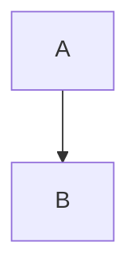

# ShapeApplication

ปิติ ต้องการออกแบบโปรแกรมสำหรับไว้ใช้ในการวาดรูปทรงต่าง ๆ
แต่ละรูปทรงสามารถเติมสีได้ รวมถึงสามารถคำนวณพื้นที่ และเส้นรอบรูปได้
และอาจมีการคำนาณคุณสมบัติอื่นของรูปทรงนั้น ๆ

ปิติเริ่มจากออกแบบคลาส Circle ที่สามารถจดสีและรัศมีของวงกลมได้ และสามารถเปลี่ยนแปลงได้ในภายหลังหากต้องการ
นอกจากเส้นรอบวงและพื้นที่แลัวคลาสนี้ยังออกแบบให้สามารถคำนวณหาเส้นผ่านศูนย์กลางของวงกลมได้ด้วย

@startuml
rectangle "Services Flow Architecture" {
    rectangle "Services Examples" as Services {
      ["queue service server"] as qss
      ["queue service consumer"] as qsc
      ["queue worker"] as qw
      ["notifications"] as notify

      qss -[hidden]down-> qsc
      qsc -[hidden]down-> qw
      qw -[hidden]down-> notify
    }

    rectangle "AWS ActiveMQ" {
        queue "events queue" as eq
        queue "events topic" as et
    }
    qss -> eq
    qsc -> eq
    notify -> eq
    qw -> eq

    eq -up-> et
}

@enduml
